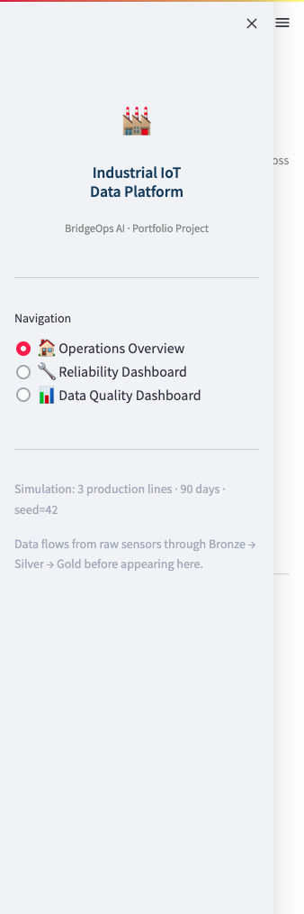
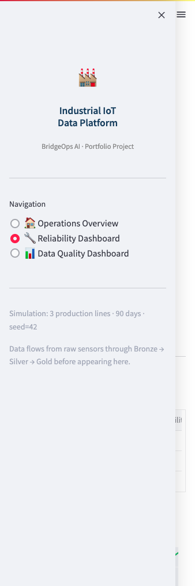
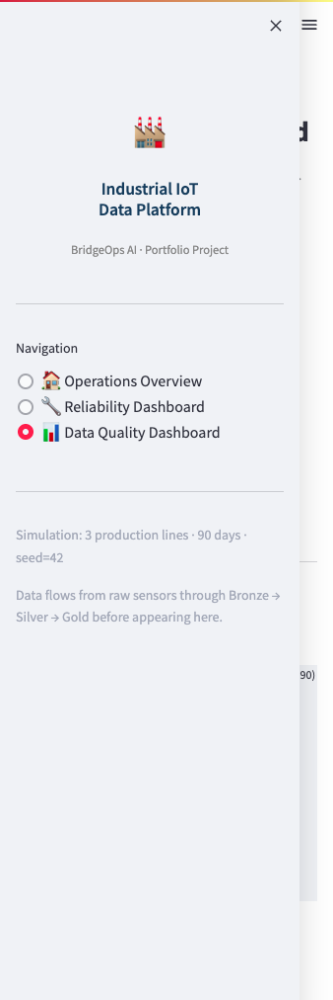

# Industrial IoT Data Platform
### BridgeOps AI — Portfolio Project #2

**Status:** MVP complete | **Framework stage:** Operations → Data → Insights  
**Stack:** Python · Pandas · Parquet · Streamlit · Plotly · Docker

---

## Executive Summary

Many organizations believe that AI begins with machine learning.

In reality, AI begins with reliable operational data.

This project demonstrates how industrial data from a multi-line manufacturing facility — sensors, machine states, quality inspections, maintenance records, and ERP production orders — can be transformed into a trusted, analytics-ready foundation. The platform is not a machine learning demo. It is a data engineering and architecture project that answers the question every industrial organization must answer before AI can succeed:

**Can we trust our operational data?**

---

## Business Problem

A mid-sized manufacturing organization operates three production lines with PLC-controlled equipment, industrial sensors, quality inspection stations, and a CMMS. The organization generates large volumes of operational data every minute but struggles to:

- Connect data across systems (sensors, quality, maintenance, ERP) into a single view
- Monitor equipment health before failures cause unplanned downtime
- Track production performance against plan at the line and shift level
- Detect quality issues early rather than at final inspection
- Create a trusted analytics layer that operations leadership can act on

Leadership wants to establish a scalable operational data platform **before** investing in Industrial AI initiatives. This is the right decision.

---

## What This Project Demonstrates

| Theme | What it shows |
|-------|--------------|
| **Industrial data ingestion** | Realistic simulation of 5 operational data streams across 3 lines for 90 days |
| **Medallion architecture** | Bronze → Silver → Gold data quality tiers, each with distinct responsibilities |
| **Data quality layer** | Explicit, scored quality checks across 5 dimensions — the layer most projects skip |
| **Operational KPIs** | OEE, MTBF, MTTR, First Pass Yield, production attainment — computed from the data foundation |
| **Dashboard** | Three-page operational dashboard: Operations Overview, Reliability, Data Quality |
| **AI readiness** | Gold-layer feature tables structured to support future predictive maintenance and anomaly detection |

---

## Architecture

```
Industrial Systems
       ↓
   Ingestion
(Python simulator)
       ↓
   Bronze Layer
(raw + load metadata)
       ↓
   Silver Layer
(validated · deduplicated · enriched)
       ↓
  Quality Checks
(5-dimension scoring per domain)
       ↓
   Gold Layer
(OEE · MTBF · FPY · Attainment)
       ↓
   Dashboard
(Streamlit · 3 pages)
       ↓
 Future AI Layer
(predictive models · GenAI · CV)
```

See [`architecture/high-level-architecture.md`](architecture/high-level-architecture.md) for the full Mermaid diagram.  
See [`architecture/medallion-architecture.md`](architecture/medallion-architecture.md) for Bronze → Silver → Gold detail.

---

## Data Domains

| Domain | Frequency | Description |
|--------|-----------|-------------|
| Sensor readings | 1-minute | Temperature, pressure, vibration, power, throughput |
| Machine states | Event-driven | Running, Idle, Planned/Unplanned Downtime, Maintenance Mode |
| Quality inspections | 30-minute | FPY, scrap, rework, defect categories by shift |
| Maintenance records | Per work order | Corrective and preventive, duration, failure category |
| ERP production orders | Daily | Planned vs. actual units by product type |

**Simulation:** 90 days · 3 lines · seed=42 · ~388,800 sensor records  
See [`docs/data-dictionary.md`](docs/data-dictionary.md) for full field-level documentation.

---

## Key Operational KPIs Computed

**Reliability**
- MTBF (Mean Time Between Failures) per line
- MTTR (Mean Time To Repair) per line
- Asset Availability

**Production**
- OEE (Overall Equipment Effectiveness) = Availability × Performance × Quality
- Daily and weekly production attainment vs. plan
- Downtime breakdown by category

**Quality**
- First Pass Yield (FPY) by line and shift
- Scrap rate trend over 90 days
- Rework vs. scrap ratio

**Maintenance**
- Work order volume by type (Corrective vs. Preventive)
- Average repair duration
- Failure category distribution

**Data Quality**
- 5-dimension composite score per domain (Completeness, Validity, Consistency, Uniqueness, Freshness)
- Per-sensor IQR-based anomaly counts
- Issue identification with threshold alerts

---

## Operational Decisions Enabled

The purpose of this platform is not reporting.

The purpose is improving decisions.

The analytics produced by the platform support several operational decision categories:

### Reliability Decisions
- Prioritize preventive maintenance activities
- Identify high-risk assets
- Allocate maintenance resources more effectively
- Reduce unplanned downtime

### Production Decisions
- Identify bottlenecks
- Improve production scheduling
- Balance throughput across production lines
- Improve overall equipment effectiveness

### Quality Decisions
- Detect emerging quality issues earlier
- Prioritize root-cause investigations
- Reduce scrap and rework
- Improve process consistency

### Data Quality Decisions
- Identify unreliable data sources
- Prioritize remediation efforts
- Improve trust in analytics
- Increase readiness for future AI systems

The platform therefore transforms operational information into actionable decision support rather than simply generating reports.

---

## Data Quality Layer

This is the most important layer in the platform for AI readiness.

Most portfolio projects skip quality checks entirely, jumping from raw data to model training. This project makes quality visible and scored because **models trained on unreliable data inherit that unreliability**.

The quality checker evaluates five dimensions per data domain:

| Dimension | What it checks |
|-----------|---------------|
| **Completeness** | Required fields present and non-null |
| **Validity** | Values within physically plausible ranges |
| **Consistency** | Records internally consistent (totals add up, end > start) |
| **Uniqueness** | No duplicate records |
| **Freshness** | Timestamps chronologically ordered and present |

A composite score (0–100) is computed per domain and displayed on the Data Quality Dashboard page.

---

## Repository Structure

```
industrial-iot-data-platform/
├── data/
│   ├── raw/            # Simulated raw CSV output
│   ├── bronze/         # Raw + load metadata (Parquet)
│   ├── silver/         # Validated + enriched (Parquet)
│   └── gold/           # Business KPIs (Parquet)
├── src/
│   ├── ingestion/
│   │   └── simulator.py        # Industrial data simulator
│   ├── processing/
│   │   └── pipeline.py         # Bronze → Silver → Gold
│   ├── quality/
│   │   └── checks.py           # 5-dimension quality checker
│   ├── analytics/
│   │   └── kpis.py             # KPI computation engine
│   └── dashboard/
│       └── app.py              # Streamlit dashboard
├── tests/
│   ├── test_simulator.py
│   ├── test_pipeline.py
│   └── test_quality.py
├── architecture/
│   ├── high-level-architecture.md
│   └── medallion-architecture.md
├── docs/
│   └── data-dictionary.md
├── notebooks/          # Exploratory analysis (future)
├── screenshots/        # Dashboard screenshots
├── run_pipeline.py     # Single-command pipeline runner
├── requirements.txt
├── Dockerfile
└── docker-compose.yml
```

---

## Quick Start

### Local setup

```bash
# 1. Clone and install
git clone https://github.com/cyranothebard/industrial-iot-data-platform.git
cd industrial-iot-data-platform
pip install -r requirements.txt

# 2. Run the full pipeline (simulate → process → quality check → KPIs)
python run_pipeline.py

# 3. Launch the dashboard
streamlit run src/dashboard/app.py
```

### Docker

```bash
# Build and run pipeline + dashboard in one command
docker compose up --build

# Dashboard available at http://localhost:8501
```

### Run tests

```bash
pytest tests/ -v
```

---

## Dashboard Pages

| Page | What it shows |
|------|--------------|
| **Operations Overview** | OEE trend by line, downtime breakdown, weekly production attainment |
| **Reliability Dashboard** | MTBF/MTTR table, availability trend, corrective vs. preventive maintenance mix |
| **Data Quality Dashboard** | Composite quality score per domain, dimension radar chart, sensor anomaly summary |

### Operations Overview



### Reliability Dashboard



### Data Quality Dashboard



---

## BridgeOps Framework Alignment

This project demonstrates the early stages of the BridgeOps Framework.

| Framework Stage | Status |
|----------------|--------|
| Operations | ✓ Demonstrated |
| Data | ✓ Demonstrated |
| Insights | ✓ Demonstrated |
| Decisions | ✓ Partially Demonstrated |
| Automation | Future Extension |
| AI-Enabled Optimization | Future Extension |

The primary objective of this project is to show how operational information can be transformed into trusted analytical insight.

Future portfolio projects extend the framework into knowledge management, decision support, automation, and AI-enabled optimization.

---

## AI Readiness

Many organizations attempt predictive maintenance, anomaly detection, or industrial AI initiatives before establishing reliable operational data foundations.

This project intentionally reverses that sequence.

Rather than beginning with machine learning models, the platform focuses on data quality, context, governance, integration, and trusted operational analytics.

The result is a foundation capable of supporting future AI initiatives at scale.

This approach reflects a core BridgeOps principle: **AI readiness begins with reliable operational information.**

### Feature Tables for Future AI

The Gold layer is structured to support the next project stage: Predictive Maintenance Platform v2.

The following feature tables can be derived directly from the existing Gold data:

| Feature group | Description | Source |
|---------------|-------------|--------|
| Rolling vibration averages | 1h, 4h, 24h rolling mean/std | Silver sensor |
| Time since last failure | Hours since most recent Unplanned Downtime | Gold reliability |
| Maintenance interval | Days since last corrective WO | Gold maintenance |
| Runtime accumulation | Cumulative running hours | Silver machine_state |
| Quality trend | 7-day FPY rolling average | Gold quality |

These feature tables are planned for Predictive Maintenance Platform v2.

---

## Technology Stack

| Component | Technology | Production path |
|-----------|-----------|-----------------|
| Ingestion | Python + NumPy | OPC-UA / MQTT → Azure Event Hub |
| Processing | Pandas + PyArrow | PySpark on Databricks |
| Storage | Local Parquet | Databricks Delta Lake |
| Quality checks | Custom Python | Great Expectations or Databricks DQX |
| KPI engine | Pandas | Databricks SQL / dbt |
| Dashboard | Streamlit + Plotly | Power BI |
| Orchestration | Manual (`run_pipeline.py`) | Databricks Workflows or Apache Airflow |
| Containers | Docker + Compose | Kubernetes / Azure Container Apps |

---

## Key Lessons

**1. Data foundations are not a prerequisite for AI — they are AI's enabling condition.**  
Every KPI in this platform depends on the Silver layer being correct. If the quality checks had found critical issues, the OEE numbers would be meaningless and any model trained on them would amplify the errors.

**2. Explicit quality scoring changes the conversation.**  
Most organizations have data quality dashboards that show "we have data." This platform shows *how trustworthy each data domain is* before a single model is built.

**3. The Medallion architecture earns its complexity.**  
Bronze preserves audit capability. Silver earns trust. Gold serves decisions. Each layer has one job and does it without leaking responsibility to the next.

**4. OEE is a lagging indicator. MTBF is a leading one.**  
Showing both together reveals whether today's throughput will be sustainable tomorrow — the kind of operational insight that motivates investment in predictive analytics.

**5. Industrial context is non-negotiable.**  
A sensor reading of 180°C means nothing without knowing whether the machine is Running, in Maintenance Mode, or experiencing Unplanned Downtime. Context enrichment at the Silver layer is what turns telemetry into information.

---

## Related BridgeOps Content

- [BridgeOps Framework](https://bridge-ops.ai/bridgeops-framework/)
- [Bridging Operations, Data, and AI](https://bridge-ops.ai/en/insights/bridging-operations-data-and-ai/)
- [Why Industrial AI Projects Fail](https://bridge-ops.ai/en/insights/why-industrial-ai-projects-fail/)
- [Why Data Foundations Come Before AI Scaling](https://bridge-ops.ai/blog/en/2026-06-data-foundations-before-ai.html)
- [Portfolio: All Projects](https://bridge-ops.ai/projects/)

---

*This is a portfolio project demonstrating realistic industrial data engineering patterns. Data is simulated. No proprietary or client-confidential information is used.*

**BridgeOps AI · [bridge-ops.ai](https://bridge-ops.ai) · Brandon Lewis**
