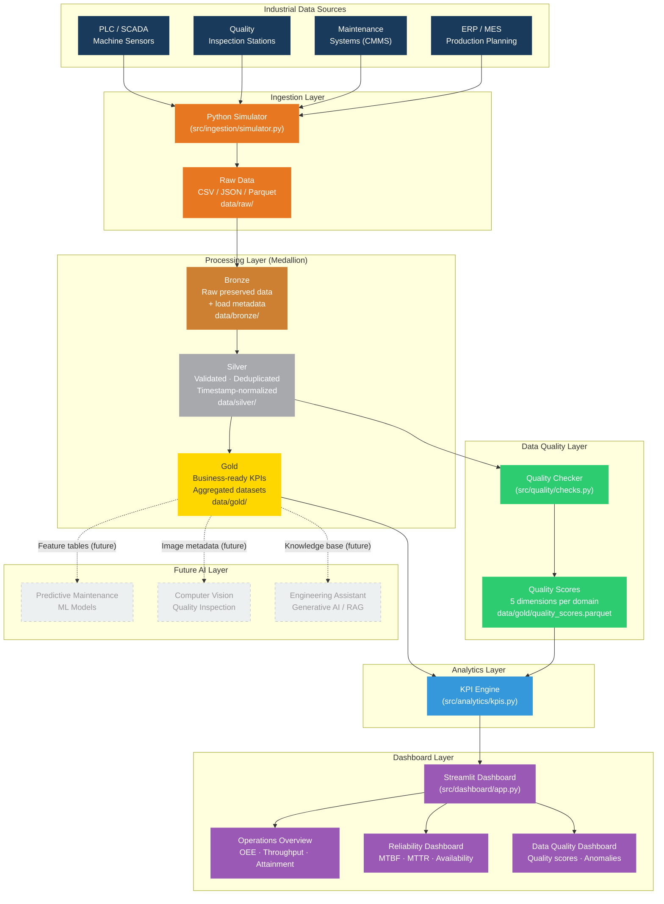

# High-Level Architecture — Industrial IoT Data Platform

## Platform Overview



## Data Flow Summary

| Stage | Input | Output | Key Operations |
|-------|-------|--------|----------------|
| **Ingestion** | Industrial systems | Raw CSV/Parquet | Simulate 5 data domains across 3 lines for 90 days |
| **Bronze** | Raw files | `data/bronze/*.parquet` | Preserve raw data + add load metadata, row hashes |
| **Silver** | Bronze Parquet | `data/silver/*.parquet` | Validate, deduplicate, impute, normalize timestamps |
| **Gold** | Silver Parquet | `data/gold/*.parquet` | Aggregate into business KPIs: OEE, MTBF, FPY etc. |
| **Quality** | Silver Parquet | `quality_scores.parquet` | Score 5 quality dimensions per domain |
| **Analytics** | Gold Parquet | DataFrames / charts | Compute reliability, production, maintenance KPIs |
| **Dashboard** | Analytics | Streamlit UI | 3-page interactive operational dashboard |

## Technology Stack

| Layer | Technology | Notes |
|-------|-----------|-------|
| Ingestion | Python / NumPy | Deterministic simulation, realistic distributions |
| Processing | Pandas + PyArrow | Medallion architecture (Bronze/Silver/Gold) |
| Storage | Parquet (local) | Designed for Databricks Delta Lake in production |
| Quality | Custom checks | ISO 25012 / DAMA-inspired 5-dimension scoring |
| Analytics | Pandas | KPI computation from Gold layer |
| Dashboard | Streamlit + Plotly | 3-page interactive operational views |
| Testing | pytest | Unit + integration test coverage |
| Containers | Docker + Compose | Single-command deployment |

## Production Evolution Path

```
Current (MVP)           → Next Step              → Production Target
─────────────────────────────────────────────────────────────────────
Local Parquet files     → Delta Lake (OSS)       → Databricks Lakehouse
Pandas processing       → PySpark                → Databricks Workflows
Simulated data          → Real PLC / OPC-UA      → Industrial IoT Hub
Streamlit dashboard     → Power BI               → Power BI + Embedded
Manual pipeline run     → Scheduled jobs         → Databricks Jobs / ADF
```
