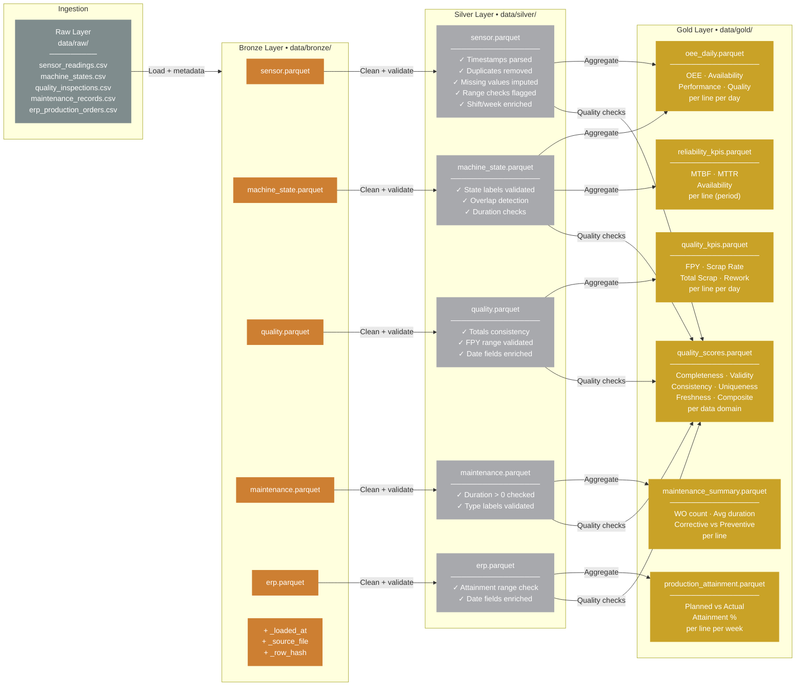

# Medallion Architecture — Bronze → Silver → Gold

## Layer Responsibilities

### Bronze — Preserve

The Bronze layer's only job is to capture what arrived and when.

- Every raw record is stored without modification
- Load timestamp (`_loaded_at`) allows replay and audit
- Row hashes (`_row_hash`) enable change-data-capture patterns
- No filtering, no transformation — exactly as received

### Silver — Trust

The Silver layer makes data reliable enough for analytics.

Key operations:

| Operation | Why it matters |
|-----------|---------------|
| Timestamp normalization | Inconsistent clock formats break joins and aggregations |
| Deduplication | Double-counted records corrupt KPIs |
| Missing value imputation | Forward-fill within line preserves temporal context |
| Range validation | Out-of-range sensor values flag potential sensor faults |
| State label validation | Invalid states indicate upstream system issues |
| Consistency checks | Totals that don't add up indicate data integrity problems |

Silver rows carry `_is_valid` flags. Downstream Gold tables use only valid rows.

### Gold — Decide

The Gold layer produces business-ready aggregates that the dashboard and KPI engine consume directly.

- Pre-computed OEE with all three components (Availability × Performance × Quality)
- Reliability metrics (MTBF, MTTR, Availability) per asset
- Daily quality KPIs (FPY, scrap rate) per line
- Weekly production attainment vs. plan
- Data quality scores per domain (consumed by the Quality Dashboard)

Gold tables are stable, small, and fast to query — optimized for Streamlit, Power BI, or SQL queries in production.
